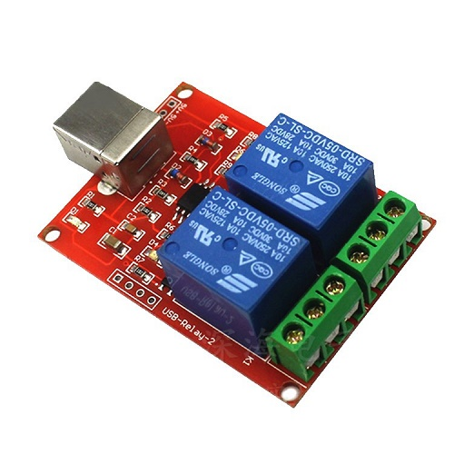

1. The TestApp dir include test application.
2. The TestAppCode dir include code of test application.
3. The usb_relay_dll dir include the dll and .h file 
4. The xcgui dir include the GUI library that used by TestApp with GUI.

https://shopee.vn/Module-2-relay-b%E1%BA%ADt-t%E1%BA%AFt-qua-c%E1%BB%95ng-USB-TH272-i.310609561.3175022445